# FlyMind

**Predicting Directed Neuron Connectivity from Biological and Morphological Features in the Drosophila Connectome**

FlyMind learns how neuron-level biological and morphological properties relate to directed connectivity in the fruit-fly brain, validates those relationships on previously unseen neurons, and ranks model-suggested candidate connections for further investigation.

---

## Launch Video

[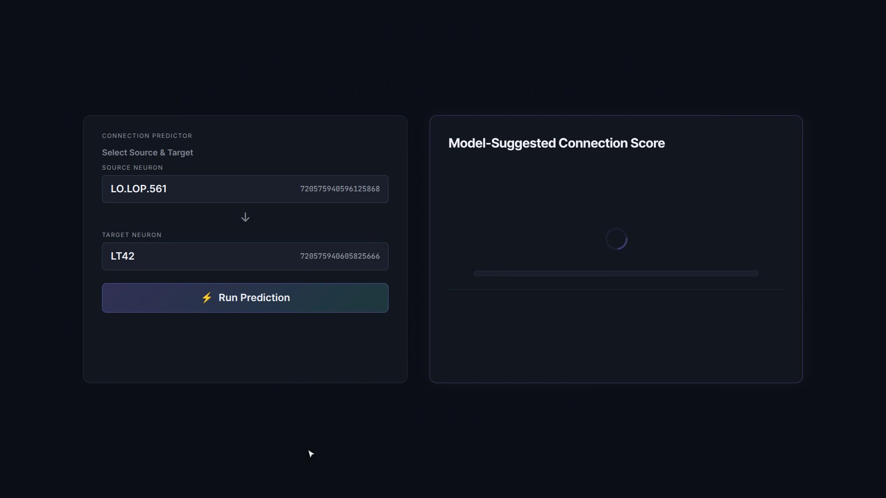](./brag-output-2026-09-23-130555/brag.mp4)

**[▶ Watch the 19-second launch video](./brag-output-2026-09-23-130555/brag.mp4)** · 1920×1080 · 30fps

https://github.com/Exit0Hero/FlyMind/raw/main/brag-output-2026-09-23-130555/brag.mp4

---

## Problem

Mapping neural connectivity is difficult. The Drosophila melanogaster connectome contains millions of directed synaptic connections between 139,255 neurons. Understanding which neurons connect to which—and whether measurable properties of neurons can predict these connections—remains a fundamental challenge.

FlyMind investigates whether biological and morphological properties of individual neurons can predict directed connectivity, and whether these relationships generalize to neurons not seen during training.

## Research Question

> Can neuron-level biological and morphological properties predict directed connectivity in the fruit-fly connectome, and do these relationships generalize to previously unseen neurons?

## Dataset

| Property | Value |
|----------|-------|
| Neurons | 139,255 |
| Directed edges | 3,732,460 |
| Node features | 15 |
| Source | FlyWire FAFB connectome |

Features include neurotransmitter expression profiles, morphological measurements (neurite length, soma area, soma size), spatial coordinates, and classification labels.

**Note:** The raw dataset is not redistributed in this repository. Obtain it from [FlyWire](https://flywire.ai/).

## Main Result

The validated Random Forest model achieves strong performance on **cold-start evaluation**—where held-out neurons have zero training connectivity information:

| Metric | Value |
|--------|-------|
| **ROC-AUC** | **0.9800** |
| **PR-AUC** | **0.9739** |

Cold-start means training edges touching held-out neurons are excluded, testing whether the model generalizes to previously unseen neurons.

## Comparison

| Model | ROC-AUC | PR-AUC |
|-------|--------:|-------:|
| Random baseline | 0.5007 | — |
| **RF node features** | **0.9800** | **0.9739** |
| RF + graph heuristics | 0.6839 | 0.5764 |
| GraphSAGE | 0.6485 | 0.6463 |

*Cold-start evaluation. RF node features retained strong performance while graph-based methods collapsed because held-out neurons have no observed training neighborhoods.*

### Key figures

| Feature importance | Calibration | Rank distribution |
|:---:|:---:|:---:|
| 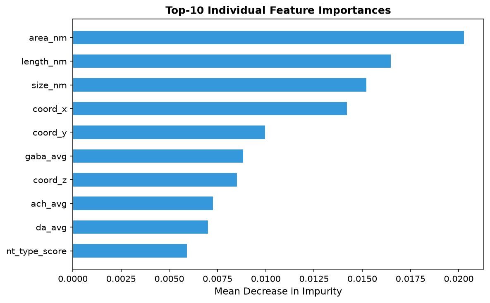 | 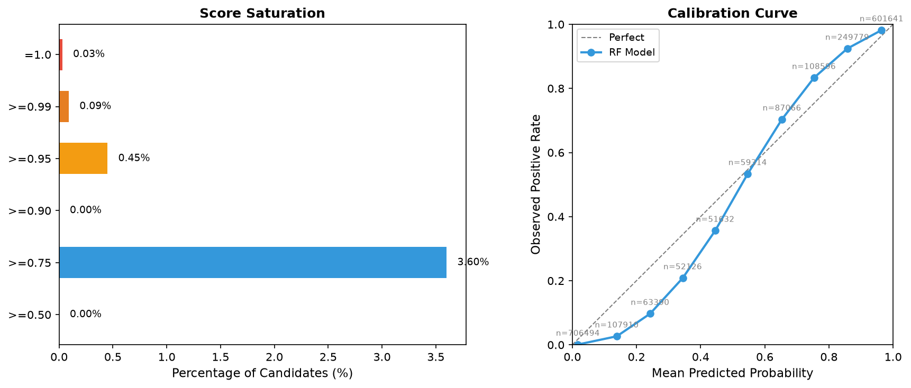 | 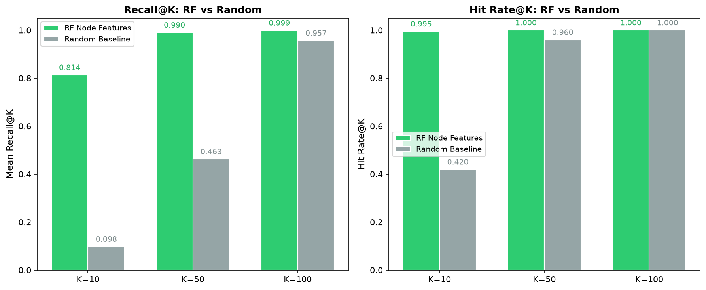 |

| Score distribution | Biological patterns | Degree distribution |
|:---:|:---:|:---:|
| 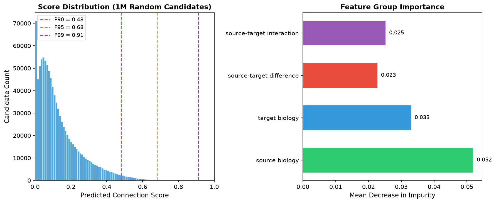 | 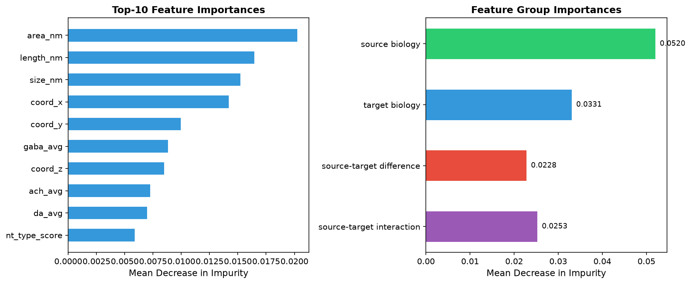 | 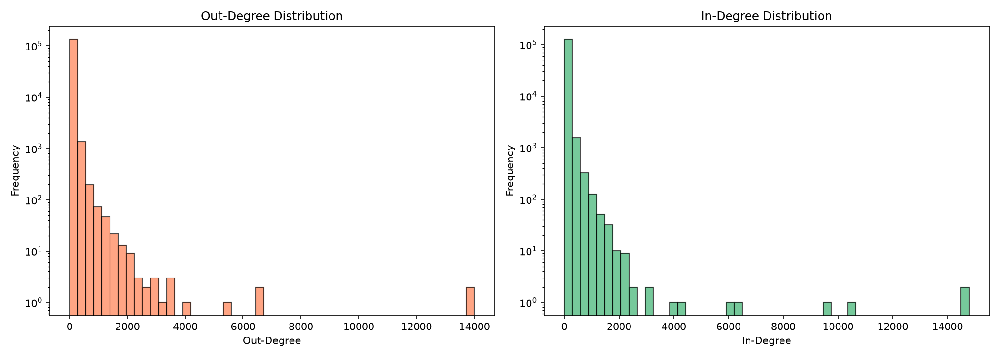 |

Training curves and GNN diagnostics:

| Training curves | Confusion matrix | Spatial scatter |
|:---:|:---:|:---:|
| 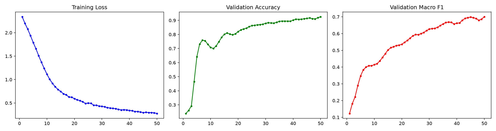 | 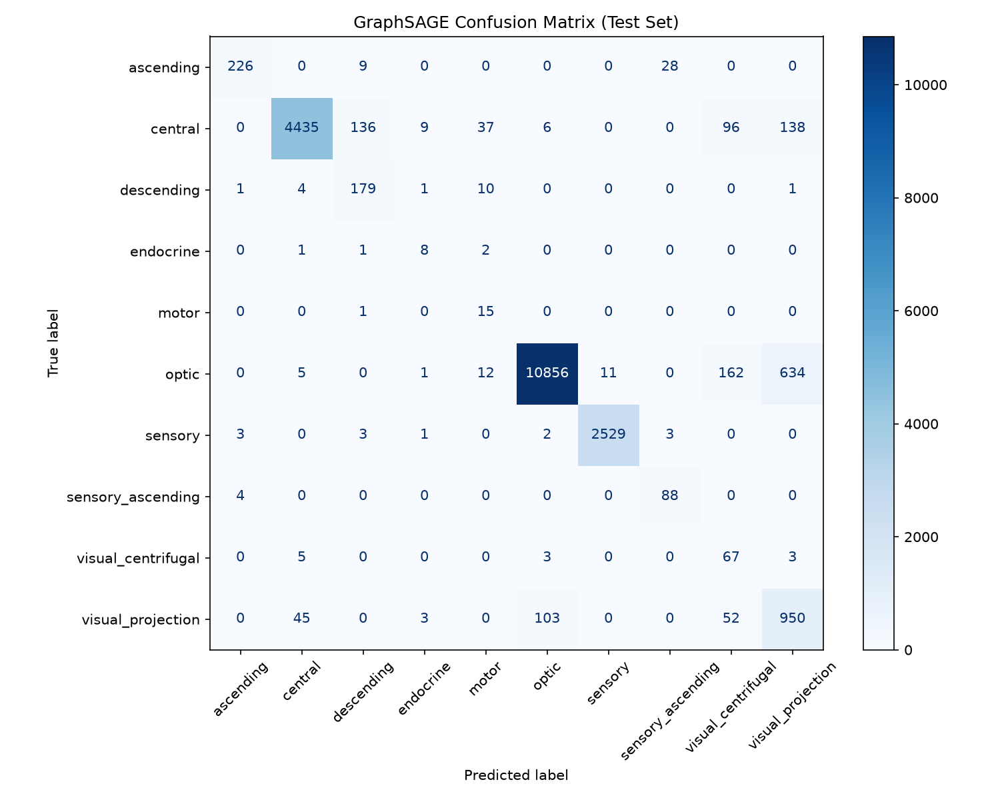 | 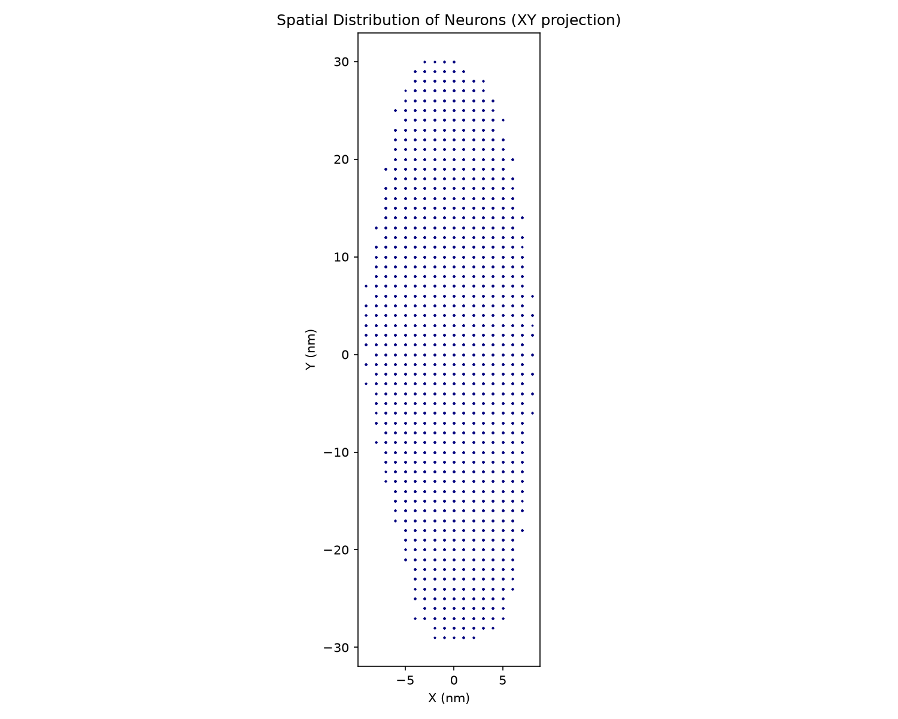 |

| Neuropil distribution | Class distribution | Annotation coverage |
|:---:|:---:|:---:|
| 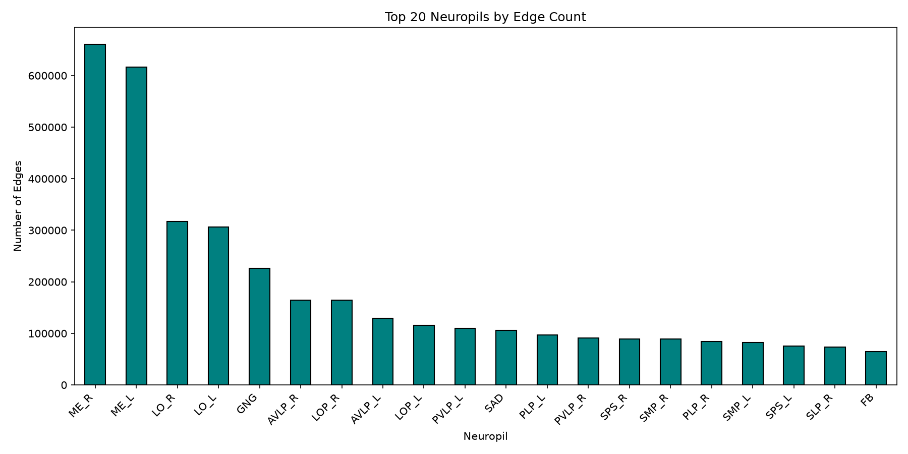 | 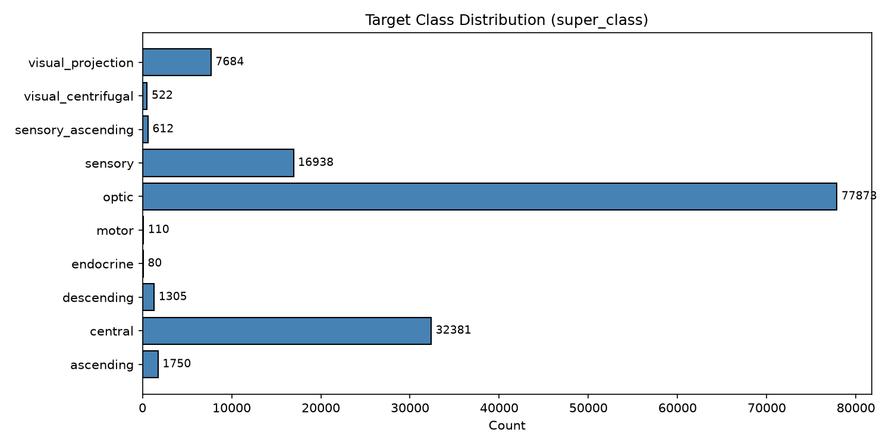 | 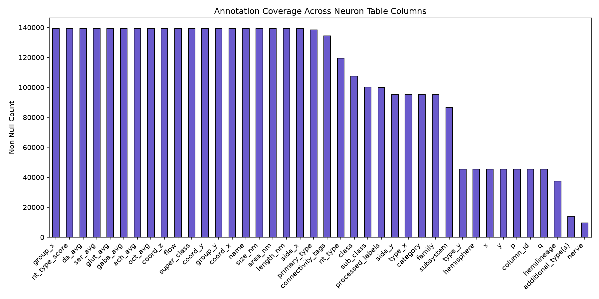 |

More figures: [`results/figures/`](./results/figures/) · robustness (`experiment_3/`) · 2D experiment (`experiment_2d/`)

## Candidate Ranking

FlyMind ranks model-suggested candidate connections for further investigation:

| Metric | Value |
|--------|-------|
| Sources evaluated | 10,000 |
| Candidates per source | 100 |
| Recall@10 | 0.814 |
| Hit Rate@10 | 0.995 |
| 8.3x improvement over random | at K=10 |

**Candidates are hypotheses, not confirmed biological connections.** They require experimental or connectomic validation.

## Architecture

```
FlyWire Data
     ↓
Data Processing
     ↓
Neuron Feature Store
     ↓
15 Node Features
     ↓
60D Source–Target Features
     ↓
Random Forest
     ↓
Connection Score
     ↓
Candidate Ranking
     ↓
Next.js Web Application (FastAPI + ML backend)
```

GraphSAGE was evaluated as a comparative model.

## Application

Interactive web application with 6 pages (Next.js frontend, FastAPI backend):

| Page | Description |
|------|-------------|
| **Overview** | Research question, key metrics, architecture |
| **Neuron Explorer** | Search and inspect individual neurons |
| **Connection Predictor** | Evaluate specific source-target pairs |
| **Candidate Ranking** | Rank candidate target connections |
| **Research Results** | Validated experiment results |
| **About / Limitations** | Scientific context and known limitations |

The application is an interface over validated research artifacts.

## Research Limitations

- **Dataset-specific:** Results apply to FlyWire FAFB dataset only
- **Incomplete annotations:** 14.1% of neurons lack neurotransmitter type labels
- **No biological validation:** Candidate connections require experimental confirmation
- **Ranking, not probability:** Scores are model-derived rankings, not calibrated probabilities
- **Experiment 2C aborted:** Neural network ablation was not completed
- **Raw data external:** Dataset must be obtained separately from FlyWire

## Reproducibility

1. Obtain the raw FlyWire data from [flywire.ai](https://flywire.ai/)
2. Place the data in the expected location (see `docs/QUICKSTART.md`)
3. Install dependencies: `pip install -r requirements.txt`
4. Run processing scripts
5. Run tests: `python -m pytest tests/ -v` (root) and `PYTHONPATH=backend python -m pytest backend/tests -v`
6. Start the stack: `docker compose up -d --build` (see `docs/DEPLOYMENT.md`)

See `docs/QUICKSTART.md` for detailed instructions.

## Documentation

| Document | Description |
|----------|-------------|
| `docs/QUICKSTART.md` | Setup and quickstart guide |
| `docs/MODEL_CARD.md` | Model documentation |
| `docs/DATA_CARD.md` | Dataset documentation |
| `docs/DEMO_SCRIPT.md` | 3-5 minute demo script |
| `docs/PRESENTATION_OUTLINE.md` | 10-slide presentation outline |
| `docs/FlyMind_Final_Research_Report.md` | Complete research paper |
| `docs/RESULTS_TRACEABILITY.md` | Metrics-to-artifacts mapping |
| `docs/FINAL_PUBLICATION_FREEZE.md` | Publication freeze report |
| `CHANGELOG.md` | Version history |

## Citation

If you use FlyMind in your research, please cite:

```bibtex
@software{flymind2026,
  title={FlyMind: Predicting Directed Neuron Connectivity from Biological and Morphological Features},
  year={2026},
  url={https://github.com/akkushon-kamen/flymind}
}
```

## License

See repository for license information. The FlyWire dataset has its own licensing terms—verify from the original source.

## Scientific Disclaimer

Candidate rankings represent **model-suggested connection hypotheses**, not confirmed biological discoveries. A high ranking score indicates statistical association in the evaluated model, not proof that a biological connection exists. Biological validation requires wet-lab experiments.
